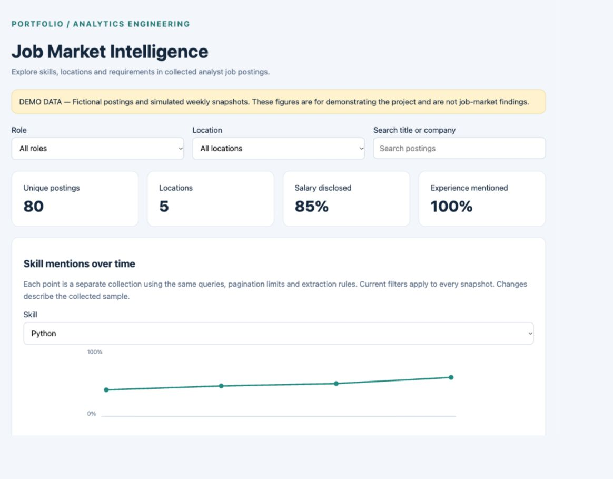
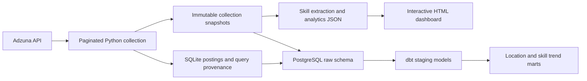

# Job Market Intelligence Platform

A working analytics portfolio project for understanding analyst job postings: API collection, deduplicated storage, immutable historical observations, deterministic skill extraction, PostgreSQL/dbt models, and an interactive dashboard.

**Status:** Live Adzuna collection is connected: 409 distinct provider IDs collected in India. PostgreSQL/dbt integration is verified on real records. See LIVE_FINDINGS.md for findings and limitations. Daily scheduling is prepared but macOS rejected activation; the schedule is not running. The demo remains synthetic.



## View the project

Open **dashboard-demo.html** in a browser. It works offline and contains 80 fictional postings and four simulated weekly observations. Filter titles and locations, search companies, inspect skills and experience, compare skill mentions across observations, and export filtered CSV.

See **PORTFOLIO.md** for the case study and interview explanation, **VALIDATION.md** for verification evidence, and **screenshots/** for desktop and mobile previews.

## Repository contents

Only source code, synthetic demonstration data and aggregate findings are included. Credentials, live API payloads, live dashboards, databases, generated dbt logs and local machine configuration are excluded from the publication package.

## Quick start

Python 3.10+ is required. The local pipeline has no third-party dependencies.

```sh
python3 pipeline.py --mode demo --demo-history
python3 -m unittest discover -s tests -v
node tests/test_dashboard.cjs
```

The `--demo-history` option replaces demonstration snapshots with four simulated weeks. Use it only for the synthetic demo. Normal runs append observations.

Use an installed Python 3.10+ interpreter. The scheduler/collection runner supports macOS and Linux; the supplied launchd schedule is macOS only.

## Connect Adzuna

1. Register at https://developer.adzuna.com/ and obtain your app ID and key.
2. Copy `.env.example` to `.env` in this project and enter your credentials locally.
3. Run a small real collection:

```sh
python3 pipeline.py --mode live --country in --query 'Data Analyst' --pages 1 --per-page 20
```

Open **dashboard-live.html** after successful collection. Do not share `.env`, the live dashboard or raw records without checking applicable provider terms. Keep keys out of chat and source control.

`.env` accepts literal KEY=value lines with optional enclosing quotes. No shell expressions are evaluated. Existing environment variables take precedence. The default country is India (`in`); confirm availability for your API account. Documentation: https://developer.adzuna.com/docs/search.

Collect all five tracked roles with:

```sh
python3 run_collection.py --mode live
```

## PostgreSQL and dbt

Use separate databases for live and demonstration records. Demo and live mode cannot be exported into the same database.

```sh
python3 -m venv .venv
source .venv/bin/activate
pip install -r requirements-optional.txt
```

Create a dedicated PostgreSQL database, then configure DATABASE_URL and PG settings in `.env`. DATABASE_URL controls the export. PG settings control dbt; both must point to the same database.

```sh
python3 export_postgres.py --mode live
cp dbt/profiles.yml.example dbt/profiles.yml
```

For a complete collection → PostgreSQL → dbt build, use:

```sh
python3 run_collection.py --mode live --warehouse
```

To test the warehouse with synthetic data, configure a dedicated **demo** database, export with `--mode demo`, then run dbt against that same database:

```sh
python3 export_postgres.py --mode demo
cd dbt
dbt build --profiles-dir . --no-send-anonymous-usage-stats
```

For manually invoking dbt, set PG environment variables in your terminal; dbt itself does not read this project's `.env`. `run_collection.py` loads `.env` before invoking dbt. Five SQL models cover current records, snapshots, observation records, latest location totals, and per-observation skill rates. Thirteen dbt data checks cover uniqueness, required values, snapshot references and valid mention rates.

The supplied requirements allow compatible updates; `requirements-tested.txt` records exact versions used for validation on this computer.

## Daily automation

The collection runner takes a local lock to prevent overlapping runs. A failed API collection rolls back its transaction; it cannot publish a partially collected snapshot. Optional warehouse failures return a failing exit status and leave the previous completed collection available.

Once live collection succeeds, generate a macOS schedule using the same Python environment that has your dependencies:

```sh
python3 make_schedule.py --hour 9 --minute 0
```

Add `--warehouse` if the PostgreSQL export and dbt build should also run daily. The generated **daily-collection.plist** schedules 09:00 in the computer's local time zone (Asia/Kolkata on this computer). It references this project's absolute path, reads credentials from the local `.env`, and writes logs in **logs/**. Keep the project at that location.

Activate the generated schedule:

```sh
launchctl bootstrap gui/$(id -u) "$PWD/daily-collection.plist"
```

Deactivate:

```sh
launchctl bootout gui/$(id -u) "$PWD/daily-collection.plist"
```

On the development computer, schedule registration was rejected by macOS and daily execution is not active. Register the schedule from your own terminal after checking the collection works. The schedule requires a logged-in macOS session and cannot guarantee execution while the computer is shut down. Start a collection manually to make up a missed observation. Current defaults collect up to two pages of 50 results for each of five role queries; verify your quota before activating.

## Architecture and data model



- `jobs`: one row per country/provider ID, raw provider payload, first and last seen timestamps.
- `job_queries`: distinct posting/query associations.
- `runs`: successfully committed live query collection counts and pagination.
- `snapshots`: immutable observation metadata and a hash of collection/extraction settings.
- `snapshot_jobs`: immutable per-observation posting payloads and extracted skills.

Dashboard counts refer to the **latest successful snapshot**, not all records ever collected. Historical comparisons include only observations whose country, queries, page limits and extraction rule version match. Changing settings begins a different comparison series. Counts represent query search samples; absence in the next collection does not establish that an advert has closed.

## Metric definitions and limits

- Skill rate = distinct observed postings mentioning a configured skill / filtered observed postings. Each posting counts once per skill, including repeated keyword mentions.
- Skill pairs are co-occurrences within postings. They do not establish causation.
- Change is expressed in **percentage points**, using separate observation denominators. This is descriptive analysis, not a statistical claim of market-wide change.
- Description snippets may omit requirements. Missing mentions do not prove missing skills.
- SQL includes MySQL and PostgreSQL; GenAI includes LLM mentions. Extraction is transparent keyword matching, not a trained NLP model. Review false positives and negatives on real snippets before drawing conclusions.
- Experience is the first explicit years phrase; ranges use their lower bound. It may refer to a particular skill. Unknown values stay unknown. Counts do not assign seniority levels.
- Salary values retain provider units and country context; predicted salaries are labeled and excluded from disclosure counts. No currency/period normalization or average-salary comparison is attempted.
- IDs deduplicate overlapping role queries, but syndicated adverts with different IDs may still be duplicates.
- Market coverage depends on Adzuna access, query wording, search ranking, quotas and page limits. The data is not a census.
- Historical payloads are preserved even when a posting changes. Timestamps are UTC in storage and trends.

## Remaining external validation

Initial real collection and a focused snippet review are complete. A measured extraction accuracy assessment and multiple comparable observations are still needed for robust market conclusions. Do not present synthetic trends as real research. Public hosting, resume matching, Snowflake and statistical trend inference are outside this completed local version.
